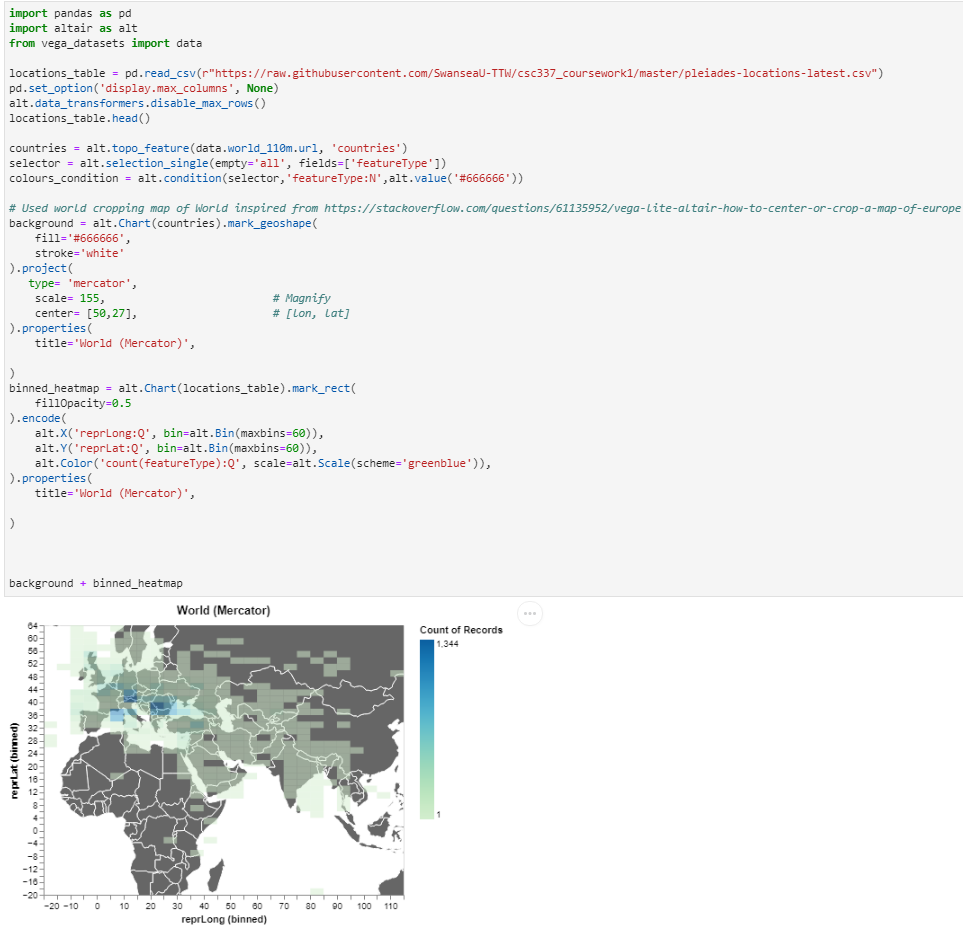

{(aim|}
Observing frequency of buildings in data set creating a density plotting graph showing what is more frequent where
{|aim)}

{(vistype|}
binned heatmap with GeoMap background
{|vistype)}

{(vismapping|}

x position
: latitude of location

y position
: longitude of location

{|vismapping)}

{(dataprep|}
Data was agregated by count of records
{|dataprep)}

{(limitations|}
Data easy to read on what is the most frequent ares but not what is the least frequent area. Boxes in the binned heatmap are too big to show particularly denser areas.
{|limitations)}
